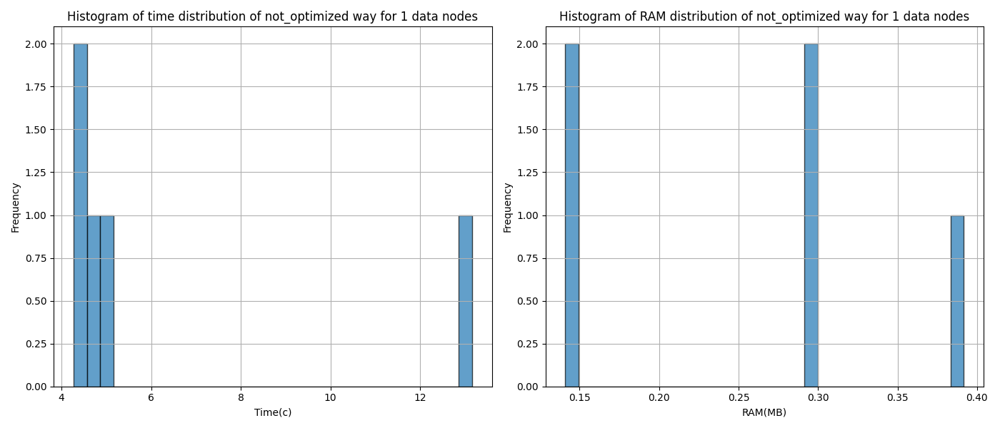
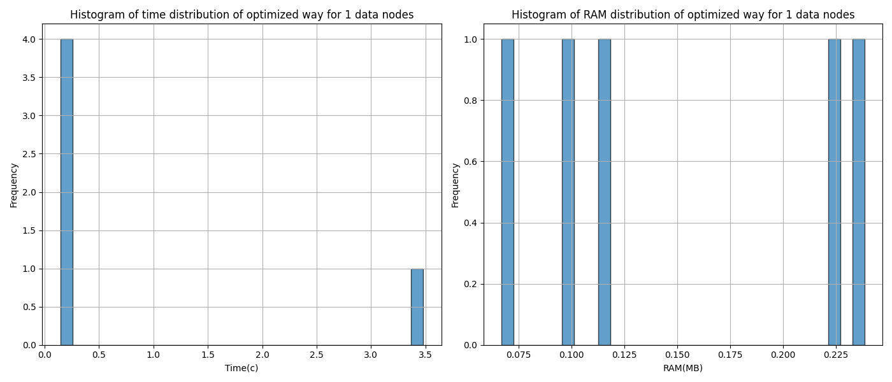
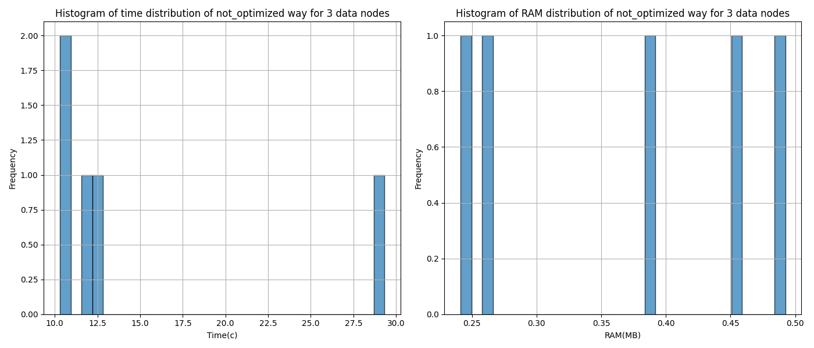
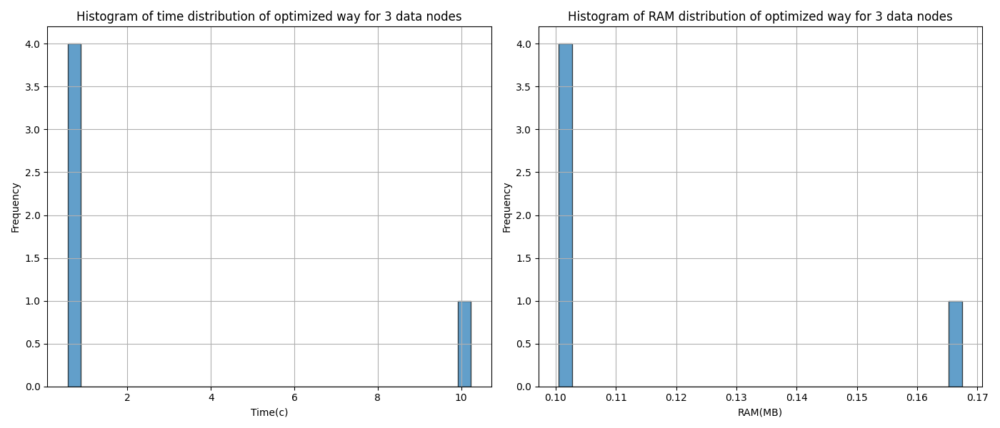

# Hadoop-Spark

## 1 DataNode

```bash
docker-compose -f docker-compose.yml up -d
docker cp data/diabetes_prediction_dataset.csv namenode:/
docker cp -L src/. spark-master:/opt/bitnami/spark/
```

```bash
docker exec -it namenode bash

hdfs dfs -put diabetes_prediction_dataset.csv /
exit
```

For general run use the following command
```bash
docker exec -it spark-master spark-submit --master spark://spark-master:7077 main.py -d hdfs://namenode:9000/diabetes_prediction_dataset.csv -n 1 -i 5

docker cp spark-master:/opt/bitnami/spark/not_optimized_num_nodes_1.png images
```




For optimized run use the following command
```bash
docker exec -it spark-master spark-submit --master spark://spark-master:7077 main.py -d hdfs://namenode:9000/diabetes_prediction_dataset.csv -n 1 -i 5 -o

docker cp spark-master:/opt/bitnami/spark/optimized_num_nodes_1.png images
```


```bash
docker-compose -f docker-compose.yml down
```

## 3 DataNodes

```bash
docker-compose -f docker-compose-3d.yml up -d
docker cp data/diabetes_prediction_dataset.csv namenode:/
docker cp -L src/. spark-master:/opt/bitnami/spark/
```

```bash
docker exec -it namenode bash

hdfs dfs -put diabetes_prediction_dataset.csv /
exit
```

For general run use the following command
```bash
docker exec -it spark-master spark-submit --master spark://spark-master:7077 main.py -d hdfs://namenode:9000/diabetes_prediction_dataset.csv -n 3 -i 5

docker cp spark-master:/opt/bitnami/spark/not_optimized_num_nodes_3.png images
```


For optimized run use the following command
```bash
docker exec -it spark-master spark-submit --master spark://spark-master:7077 main.py -d hdfs://namenode:9000/diabetes_prediction_dataset.csv -n 3 -i 5 -o

docker cp spark-master:/opt/bitnami/spark/optimized_num_nodes_3.png images
```



```bash
docker-compose -f docker-compose-3d.yml down
```